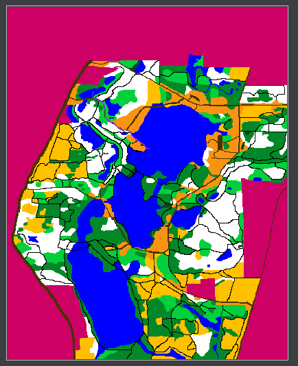

# Orienteering

An A* algorithm is used to find the optimal path between a set of points. The path is drawn (in purple) over the given environment image. In the image below, a purple line between two points can be seen in the top left quadrant.
Inputs are the environment image which indicates the type of terrain via color, and an elevation file which is a txt file of elevations at each pixel. 

This project is utilizing real data from the Mendon Ponds Park in Rochester, NY.

